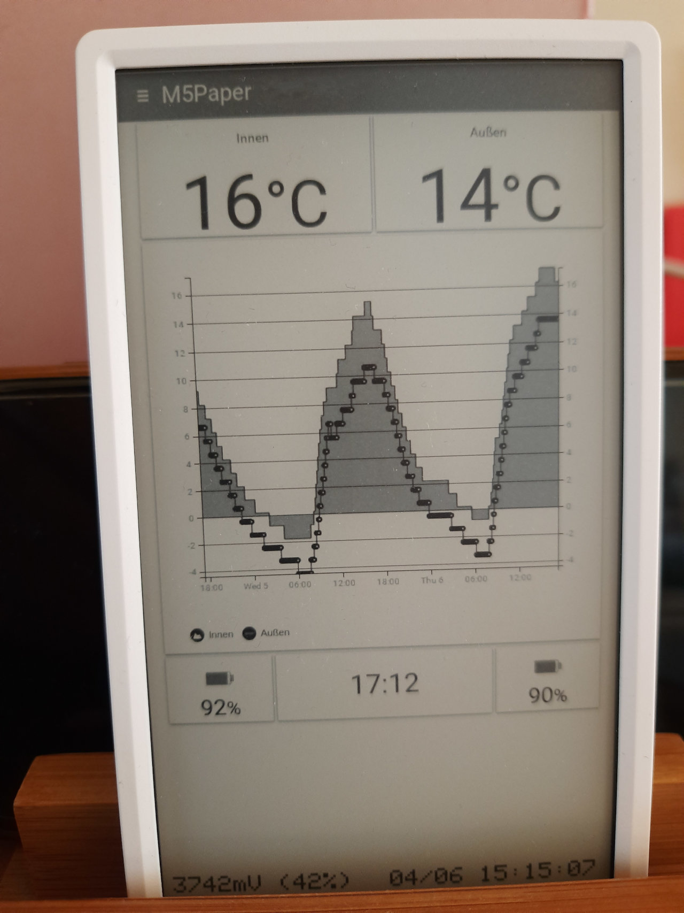

# M5Paper Remote Dashboard

Periodically renders a remotely created JPG as a dashboard on an M5Paper.

The M5Paper wakes up at `:00`, `:15`, `:30`, `:45`, connects to WiFi, downloads a JPG which is then rendered full-screen. Additionally, the device renders its current battery stats and RTC information on the bottom of the screen.

## Why?

Creating a good-looking dashboard is easier when not done in C++. There are plenty of decent looking dashboarding solutions available.
The dashboard shown in the photo above uses:

* [HABPanel][2] dashboard configured in [OpenHAB][1]
* Periodic screenshots created using [Puppeteer][3] via [`M5Paper_Remote_Dashboard_Puppeteer`][4] docker image

## How to use

Configuration is done inside `my_settings.h` prior to compiling and uploading the project.

* `MY_WIFI_SSID`: replace with your WiFi SSID
* `MY_WIFI_PASSWORD`: replace with your WiFi password
* `MY_URL_TEMPLATE`: adjust to from where to download the JPG. The following placeholders are supported:
   * `{mac}`: will be replaced with the device's MAC address, e.g. `30:C6:F7:FF:FF:FF`
   * `{rtcdatetime}`: will be replaced with the current RTC date and time, e.g. `2023-04-08T18:15:04`
   * `{voltage}`: will be replaced with the current battery voltage in mV, e.g. `3722`
   * `{batterypercent}`: will be replaced by an estimate of the current battery percentage, which is calculated based on the example algorithm provided for M5Paper, e.g. `40`
   * `{width}`: the device display width in pixels, e.g. `540` (in portrait mode), or `960` (in landscape mode)
   * `{height}`: the device display height in pixels, e.g. `960` (in portrait mode), or `540` (in landscape mode)
   * `{wokenByRTC}`: `true` if device booted due to RTC interrupt (timer), else `false` (power-button , USB/power connected, etc.)

The example value would result in a request to `http://example.com/devices/30:C6:F7:21:19:AC/screen.jpg?rtcdatetime=2023-04-08T18:15:04&voltage=3722&batteryPercent=40&width=540&height=960`

## Battery Life

The implementation is as power-saving as possible. The device wakes up via RTC every 15min, connects to WiFi, renders the screen and turns itself completely off. The actual runtime to expect will depend on several factors (age of battery, WiFi signal strength, etc.). In my case, one battery charge lasts between 10-20 days.

## Time Synchronization

Time is synchronized via SNTP once a day (at the 00:00 wake-up interval), or if the RTC is clearly reset (year before 2022). By default, Google's NTP servers are used:

* `time1.google.com`
* `time2.google.com`

## Why JPG and not PNG?

The source-code for PNG mentions "it's really slow". And it _really_ is. Rendering a full-screen PNG took >1min in my experiments. This resulted in noticeable latency when waking the device manually (via power-button) or when developing. Also, it resulted in a significantly larger battery drain.

On the other hand, rendering the JPG takes only a few seconds and the quality trade-off is not really noticeable to me.

## Why the complicated sleep logic?

Basically, because I experimented with the various RTC wake-up modes. And because `M5.shutdown()` does not work when connected to external power, e.g. during development. In this case, deep-sleep (`esp_deep_sleep`) is used instead.

RTC allows for second precision up to 255 seconds. And up to 255 minutes beyond that. Longer sleeps are not possible without triggering at a specific RTC date/time. Waking at `:00`, `:15`, `:30`, `:45` is the perfect use-case for waking with RTC-date/time. But since it does not work when connected to power, it falls through to delay-based sleeping and finally `esp_deep_sleep` while connected. If device is disconnected while in this sleep-state, it will likely wake up not exactly at the correct time, unless the next wake-up time was <=255 seconds in the future.

## Future improvements

If connection to WiFi cannot be established within 5 seconds and/or something goes wrong with the download of the JPG, a blank screen with only the device-side rendered status bar is shown.

If you manually wake-up the device using the power-button, visual feedback is only available once WiFi connection is established, JPG has been downloaded and the screen is updated. Earlier feedback would be sensible.

## Acknowledgements

Based on the examples provided by M5Stack's [`M5EPD`][5] library. Especially the [RTC example][6].

[1]: https://www.openhab.org/
[2]: https://www.openhab.org/addons/ui/habpanel/
[3]: https://pptr.dev/
[4]: https://github.com/capi/M5Paper_Remote_Dashboard_Puppeteer
[5]: https://github.com/m5stack/M5EPD/
[6]: https://github.com/m5stack/M5EPD/blob/main/examples/Basics/RTC_BM8563/RTC_BM8563.ino
